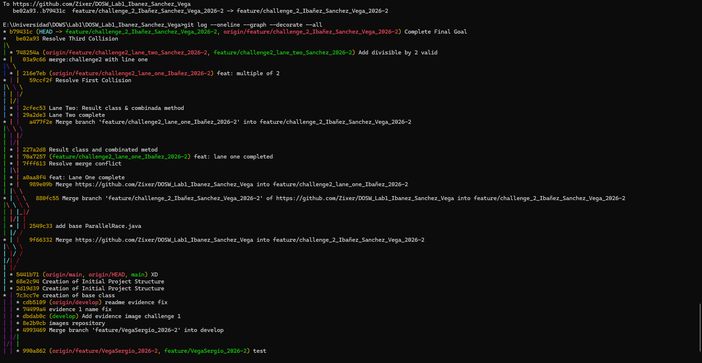

## Challenge 2 – Parallel Race

### Evidence

### Description

Briefly explain:

- Implemented a Java application that simulates parallel development using functional programming and Git branching. The solution processes two lists of numbers using Java Streams and lambda expressions to calculate the maximum value, minimum value, and total number of elements for each list.
- The implementation also validates whether the maximum value is a multiple/divisor of 2 and whether the list size is even or odd using ternary operators. Finally, both lists are processed and their results are combined into a Result object.
- The work was divided as follows:
  - Yazid: Implemented the lane for finding the maximum value and the related validations.
  - Santiago: Implemented the lane for finding the minimum value, counting the elements, and the related validations.
  - Sergio: Created the project documentation (README.md).
- Git operations used: creation of feature branches, parallel development, commits, merges, conflict resolution, and synchronization between branches using Git.
- Merge conflicts were intentionally generated during development and resolved correctly after integrating both branches.
- The final version combines the contributions from both lanes into a single implementation that processes two lists and returns the required information.