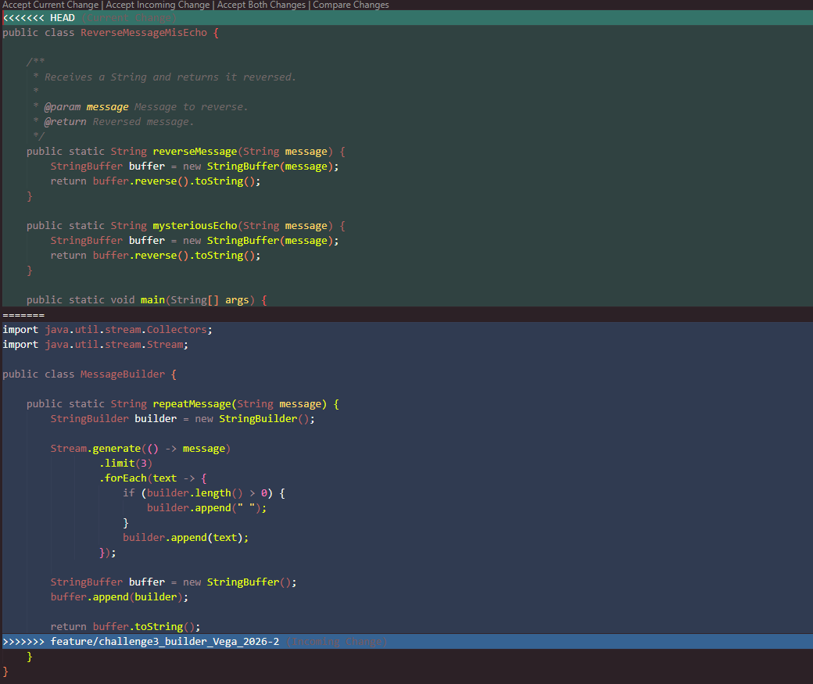

## Challenge 3 – The Mysterious Echo

### Evidence

### Description

Briefly explain:

- Implemented a Java application that transforms messages using both StringBuilder and StringBuffer. The solution applies functional programming concepts such as Java Streams and lambda expressions to process and manipulate the messages.
- The StringBuilder implementation receives a message, repeats it three times, and separates each repetition with a space. The StringBuffer implementation receives a message and reverses its content.
- The work was divided as follows:
  - Sergio: Implemented the StringBuilder solution for repeating the message three times using Streams and lambda expressions.
  - Daniel: Implemented the StringBuffer solution for reversing the message.
  - Yazid: Created the project documentation (README.md).
- Git operations used: creation of separate feature branches, commits, pushes, merges, and merge conflict resolution during the integration of both implementations.
- A merge conflict was generated by implementing the same function from both branches and was resolved by combining both approaches.
- The final objective combines StringBuilder and StringBuffer so that the message is repeated three times and the resulting message is reversed.