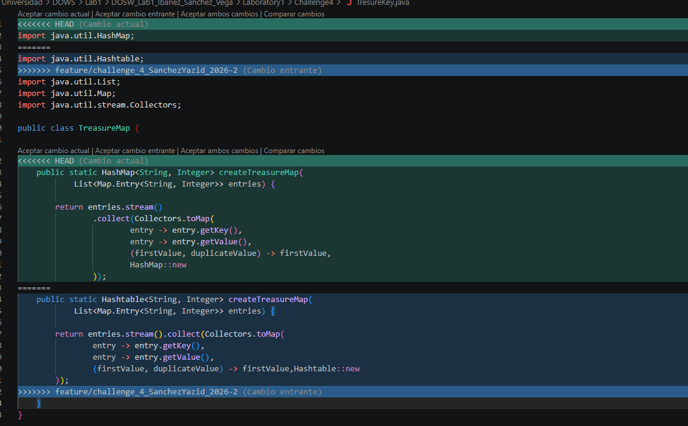

## Challenge 4 – Treasure Map

### Evidence

### Description

Briefly explain:

- Implemented a Java application that creates and combines treasure maps using both HashMap and Hashtable. The solution processes key-value pairs with Java Streams and lambda expressions while handling duplicate keys according to the specified rules.
- The final implementation combines both maps by prioritizing values from the Hashtable when duplicate keys exist, converting all keys to uppercase, sorting them in ascending order, and printing the resulting map.
- The work was divided as follows:
  - Yazid: Implemented the Hashtable solution.
  - Daniel: Implemented the HashMap solution.
  - Sergio: Created the project documentation (README.md).
- Git operations used: creation of feature branches, parallel development, commits, merges, and merge conflict resolution during the integration of both implementations.
- A merge conflict was intentionally generated and successfully resolved while combining the HashMap and Hashtable implementations into the final solution.