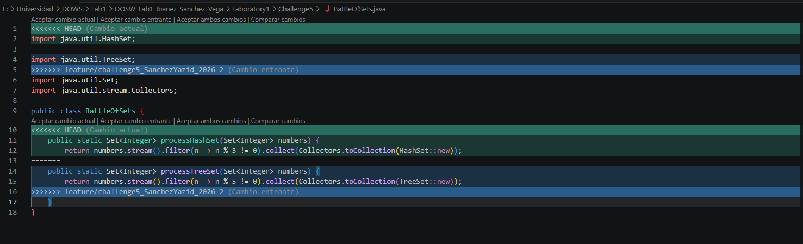

## Challenge 5 – Battle of Sets

### Evidence

### Description

Briefly explain:

- Implemented a Java application that simulates a battle between two collections using `HashSet` and `TreeSet`. The solution processes two sets of integers using Java Streams, `filter()` operations, and lambda expressions.
- The implementation removes multiples of 3 from the `HashSet` collection and multiples of 5 from the `TreeSet` collection. After processing, both collections are merged into a single ordered `TreeSet`, automatically removing duplicate values while preserving ascending order.
- The work was divided as follows:
  - Yazid: Implemented the `HashSet` solution, filtering multiples of 3.
  - Sergio: Implemented the `TreeSet` solution, preserving natural ordering and filtering multiples of 5.
  - Santiago: Created the project documentation (README.md).
- Git operations used: creation of feature branches, parallel development, commits, merges, conflict resolution, and synchronization between branches using Git.
- Merge conflicts were intentionally generated during development and resolved correctly after integrating both branches.
- The final version combines both collections into a single ordered structure, removes duplicate values, and prints the final result using lambda expressions.

