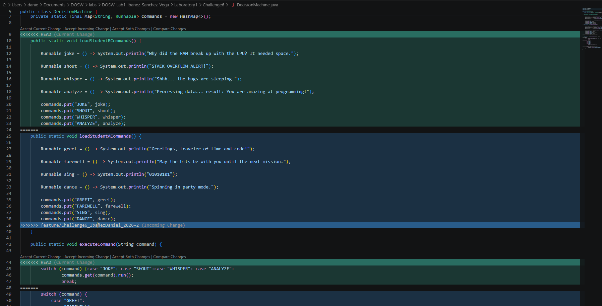

## Challenge 6 – The Decision Machine

### Evidence

### Description

Briefly explain:

- Implemented a Java application ("The Decision Machine") that processes and responds to text commands using a Map<String, Runnable> structure combined with lambda expressions and switch statements.
- The application separates command registration into distinct methods (loadStudentACommands and loadStudentBCommands), where actions are mapped to executables using lambdas.
- The work was divided as follows:
  - Sergio: (JOKE, SHOUT, WHISPER, ANALYZE).
  - Daniel: Implemented Student A commands (GREET, FAREWELL, SING, DANCE).
  - Yazid: Created the project documentation (README.md).
- Git operations used: creation of separate feature branches, commits, pushes, merges, and merge conflict resolution during the integration of both command sets.
- A merge conflict was generated because both branches modified the command loading methods and switch execution logic within DecisionMachine.java, which was resolved by combining both sets of commands and switch cases into a single unified implementation.
- The final objective unifies all commands into the commands map and executes them successfully to demonstrate every command option.

